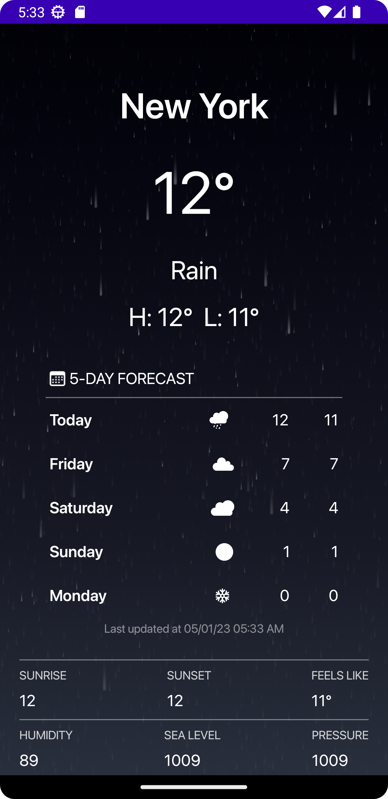
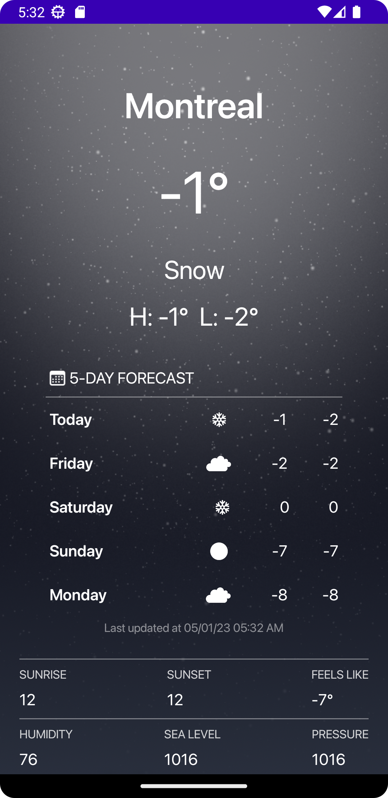
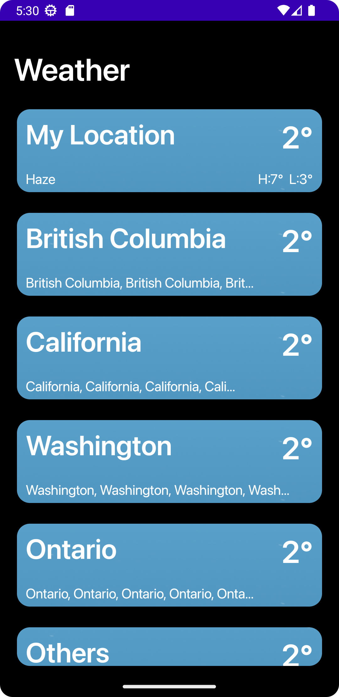

# Mobile Programming Course Projects

This repository contains my solutions to the project assignments for the "Mobile Programming" course.

## Project 4: Weather App

[Aim: Learning how to work communicate with APIs in an Android app]

A simple weather app that displays current and forecast weather for a selected city.

- It allows searching for a city and selecting from matches.
- It shows temperature, condition, highs/lows for the selected city. 5 day / 3 hour forecast data is displayed in chart
  and list views.
- OpenWeatherMap APIs were used to retrieve real weather data and handle errors properly.

| Title                       | Screen                                                              |
|-----------------------------|---------------------------------------------------------------------|
| City weather screen (rainy) |  |  
| City weather screen (snowy) |  |
| City list screen            |       |

## Project 3: Currency Converter

The goal of this project is to create a simple currency converter app.

- It displays a home screen to select the "from" and "to" currencies using UI elements like spinners.
- A button initiates the conversion using the user's input amount and displays the result.
- A settings screen allows customizing default currencies, amounts, and swap options.
- Conversion rates from a fixed date were used.

| Title                     | Screen                                                                                     | 
|---------------------------|--------------------------------------------------------------------------------------------|
| Home screen               |                |
| Currency selection screen |  |

## Project 2: Book List

[Aim: Learning different layouts and navigation]

The book display section of an ebook reader app.

- On the first screen, a list of books is displayed including the book cover image, title, and author name. The user can
  view the list as a vertical stack or in a 3 column grid layout.
- The user can click a book cover to see more details on another screen. This screen displays the cover image and
  information like author, publisher, publication year, summary, etc.

| Title                        | Figure                                                                |
|------------------------------|-----------------------------------------------------------------------|
| Book list screen (list view) |  |
| Book list screen (grid view) |  |

## Project 1: Faal Hafez (Fal-e Hafez)

[Aim: Learning how to set up a simple android app with buttons]

A simple Faal-e Hafez (Hafez fortune-telling) app.

- When launched, this app shows a button at the bottom of the screen to get a Faal (fortune). Pressing it randomly
  selects and displays one of several Hafez poems, that are stored in the app. The user can get more Faals by pressing
  the button more.
- An "About" button is also provided next to the "Get Faal" button that shows some general info about the app like its
  version num and author.
- A theme is set up for the whole app to give it a unique look and feel through color and font choices. An appropriate
  app icon is also selected and added.

| Title               | Screen                                                             |
|---------------------|--------------------------------------------------------------------|
| App launch screen   |    |
| Faal display screen |  |

## Course Information

- **Course**: Mobile Programming
- **University**: Amirkabir University of Technology
- **Semester**: Fall 2022

Let me know if you have any questions!

